# 2025年排名前12的Microsoft Intune自动化平台盘点(最新整理)

管理几百台设备的公司,IT团队每天光是部署补丁、配置策略、检查合规性就要耗掉大半天时间。传统的手动管理方式不仅效率低,还容易出错导致安全漏洞。现在Microsoft Intune自动化平台把这些重复劳动全自动化了,从设备注册、应用部署到安全策略执行,一个控制台就能搞定Windows、macOS、iOS、Android全平台。这些工具能帮IT团队把工作效率提升10倍以上,把手动操作时间从每周40小时压缩到4小时以内。下面整理了12个在端点管理和设备自动化领域最靠谱的平台,从专注Intune增强到全平台统一管理都有覆盖。

***

## **[Devicie](https://devicie.com)**

基于Intune的超自动化平台,从人工救火升级到预防性管理

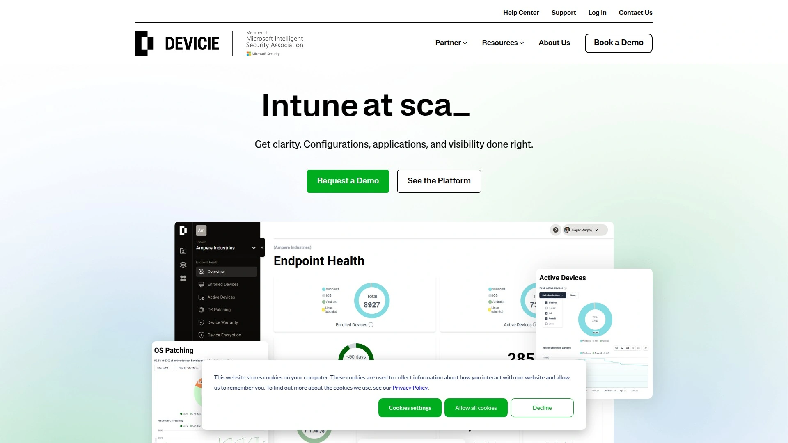

Devicie是专门为提升Microsoft Intune能力而生的超自动化平台,帮助IT团队和MSP从疲于应付问题转向主动预防。通过自动化繁重的配置和管理工作,让企业在保持高峰性能的同时实现大规模设备和软件管理。

**生成式配置引擎**是核心差异化:能自动生成最优化的Intune配置,确保安全、合规和运营效率贯穿整个设备生命周期。不需要手动编写复杂的策略和脚本,系统会基于最佳实践自动生成配置。

覆盖全平台设备管理:Windows、macOS、iOS和Android设备都能从单一云端平台快速配置为安全合规的状态。员工可以在任何地方拆箱新设备,简单登录后自动安装应用、部署配置、加固安全,完全不需要IT人员介入。

**等待Intune成熟的先行者**:Devicie的创始人从Intune诞生初期就跟踪研究,一直在寻找通过互联网完全保护和管理终端设备的方法。他们知道Intune是最佳候选,因为它原生支持无需第三方代理。当Intune成熟到可以部署应用后,他们立刻意识到可以创建一个完整的、自动化的、组织级终端安全管理解决方案,完全不需要人工IT资源。

从策略管理、更新到合规报告和应用补丁,Devicie自动化处理Intune中最繁重的任务。客户包括PointsBet和Nine Entertainment Co等知名企业。总部在澳大利亚,支持远程团队,计划未来一年团队规模翻倍并扩展到美国、英国和欧洲市场。

***

## **[NinjaOne](https://www.ninjaone.com/endpoint-management/)**

全平台端点管理,用户体验和性价比双优

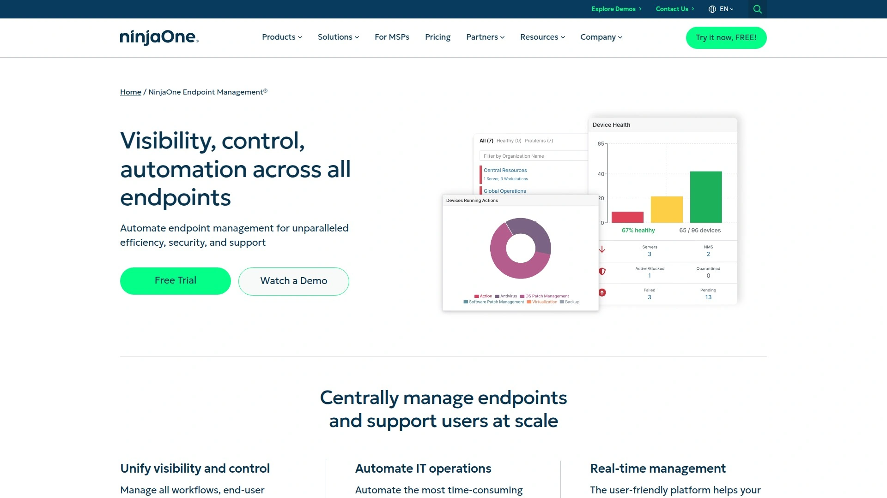

NinjaOne提供跨所有端点的可见性、控制和自动化,能够集中管理和大规模支持用户。客户反馈说通过自动化节省了大量手动任务时间,用一个工具替代了3-4个其他工具。

**核心能力**包括补丁管理、硬件和软件清单、软件管理、端点任务自动化、自动修复、基于表单的脚本部署、安全远程访问、监控告警和灵活的设备报告。可以创建一体化软件安装包,在任意数量设备上构建和执行。

**自动修复功能**特别实用:通过基于条件的脚本部署,完全自动化检测和解决端点问题,比如停止的服务、错过的重启、缺失的应用。能标准化结果、解放技术人员、提升设备稳定性。

用户友好的Web界面和强大的移动应用是亮点,对寻求成本效益管理方案的小企业特别有吸引力。整合了Bitdefender安全功能,虽然有用户希望更多第三方兼容性。SLA系统增强了性能跟踪。

在G2 2025夏季评分中,NinjaOne总分4.7(2618条评价),各项指标包括满足需求9.1、易用性9.2、设置简易度9.2、支持质量9.2都表现优异。MSP和转向云端的企业广泛使用,支持无缝软件部署和改进的资产管理。

***

## **[Automox](https://www.automox.com)**

策略驱动的自动化补丁,跨平台统一管理

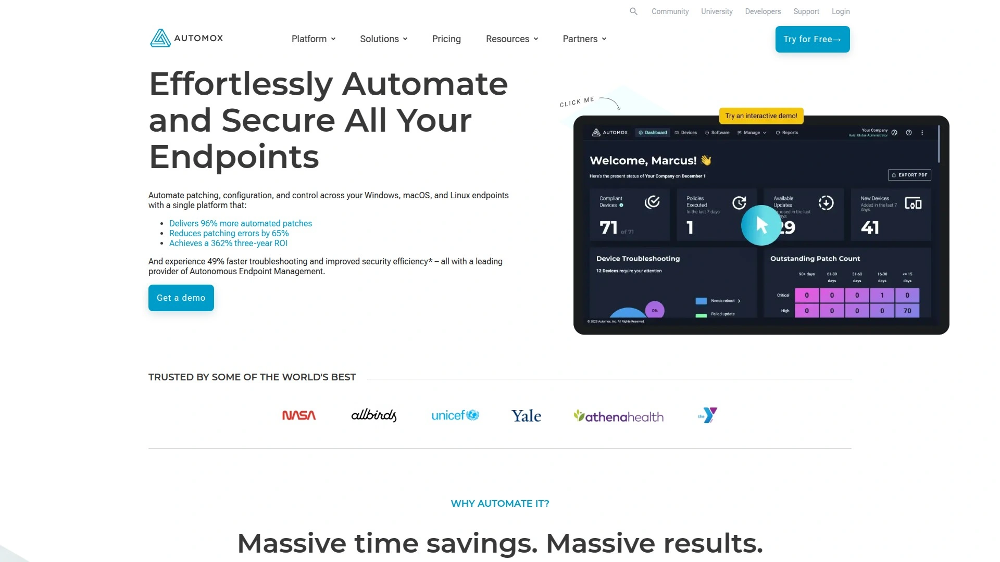

Automox从单一平台自动化Windows、macOS和Linux端点的补丁、配置和控制。客户每1000台设备每年平均获得23万美元收益,3年ROI达362%,4个月回收投资。

**补丁管理是核心强项**:96%更多补丁通过策略驱动自动化完成,任何软件、任何端点、世界任何地方都能管理。从单一控制台补丁Windows、macOS和Linux,真正自动化数百个软件标题的补丁。Patch Safe功能确保安全性。

**策略驱动自动化**确保操作系统和第三方应用持续打补丁、保持最新和免受漏洞攻击,降低网络攻击风险。轻量级单一代理消耗最小系统资源,对最终用户影响几乎感觉不到。

**配置管理**能让所有端点符合安全和合规标准,通过自定义脚本和工作手册强制执行设置、简化管理任务。支持数百个软件标题,节省数千小时。

在G2评分中总分4.4(271条评价),易用性9.0,设置简易度9.2,支持质量8.8。用户反馈说管理多设备时速度可能变慢,报告功能有改进空间,界面更适合有经验的IT专业人员。适合需要大规模自动化补丁和配置管理的企业。

***

## **[Kandji](https://www.kandji.io)**

Apple设备管理专家,自动化和AI完美结合

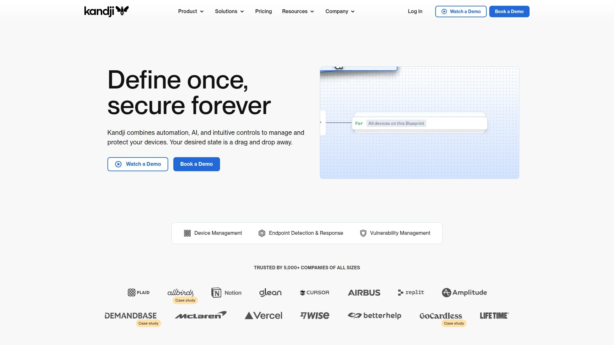

Kandji是云端原生的Apple设备自动化管理平台,结合自动化、AI和直观控制来管理和保护Mac、iPad和iPhone。被5000多家各种规模的公司信任。

**零接触部署**:员工打开Mac包装的那一刻就自动配置安全策略、应用和设置,完全不需要IT干预。提供品牌化的入职体验,给员工完美的第一天工作体验。

**应用和OS更新自动驾驶**:从200多个Auto Apps到Custom Apps和Managed OS,Kandji让精简IT团队可以及时保持软件一致更新,同时提供无摩擦的员工体验。创建清晰的配置逻辑,在无限画布上可视化和精确控制部署到每台设备的内容。

**AI辅助决策**:对工作场所Apple设备的任何问题快速获得有洞察力的答案,利用AI的力量洞察你的设备群,完全保护数据隐私。

**Mac恶意软件防护**:Kandji以最深的macOS生态防御领先,用AI驱动保护阻止攻击,检测持续用AI进化并由专门的安全研究支持。可以调查威胁事件,看到到底是哪些文件或行为触发了事件,以及调查威胁和评估影响所需的所有关键细节。

定价模式是年度订阅,每台设备约122美元。提供一键合规蓝图满足CIS、NIST等标准,MDM+轻量级代理确保最大可靠性和灵活性。免费企业支持是业内最慷慨的,几分钟内就能从Kandji真人代表那里得到答案。

***

## **[Jamf Pro](https://www.jamf.com/products/jamf-pro/)**

Apple MDM领导者,企业级移动设备管理

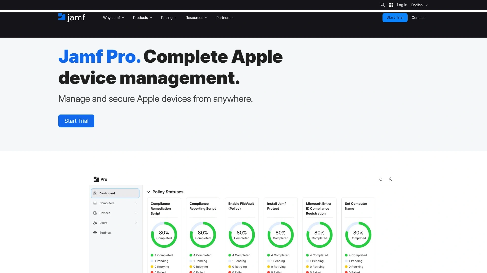

Jamf Pro是Apple移动设备管理的行业标准MDM软件,被教育机构和企业广泛采用来管理Mac、iPad和iPhone。

**端点管理核心**:端点是通过互联网连接组织资源的任何设备,包括笔记本电脑、台式机、移动设备、平板电脑和物联网设备。Jamf提供完整的端点生命周期管理,从注册到退役。

**安全和保护**:移动端点保护和Apple安全是Jamf的强项,能检测威胁、保护数据、确保设备合规。集成的威胁防御能力为iOS和macOS设备提供实时保护。

大学和企业IT部门使用Jamf Pro集中管理Apple设备,推送配置、部署应用、执行安全策略。Cornell和Trinity College等知名学府都采用Jamf作为标准Apple设备管理工具。

适合Apple设备占主导地位的组织,提供最深度的macOS和iOS管理能力。在Apple生态系统的功能集成度和原生支持方面超过通用MDM工具。

***

## **[ManageEngine Endpoint Central](https://www.manageengine.com/products/desktop-central/)**

统一端点管理老牌,性价比高功能全

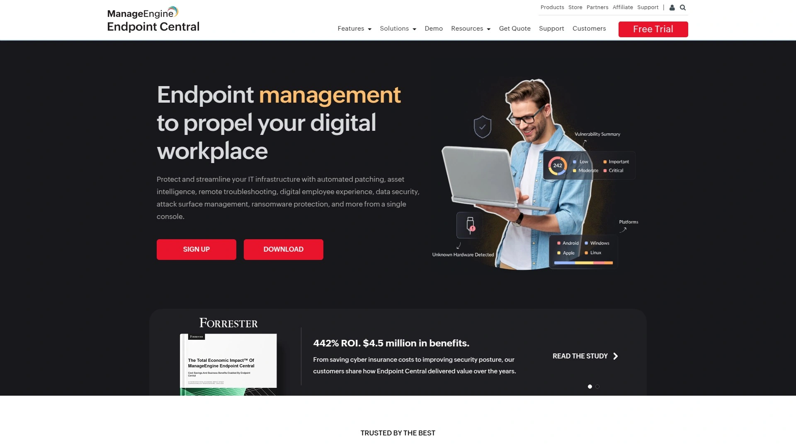

ManageEngine Endpoint Central(前身Desktop Central)是统一端点管理解决方案,从单一控制台管理数千台服务器、台式机、笔记本和移动设备。

**全面的IT功能**:补丁管理、软件部署、远程故障排除、移动设备管理、数字化员工企业等,从统一控制台监控、管理和排查端点。可以自动化所有系统管理任务,比如Windows、Mac、Linux和第三方补丁,安装卸载商业软件,生成硬件和软件许可合规报告,执行安全管理,远程故障排除,系统镜像和OS部署,管理移动设备。

**代理工作机制**:通过安装在设备上的代理收集数据并执行任务,帮助收集关键信息如缺失补丁、漏洞和其他信息如安装的应用。代理协助端点管理器执行在中央控制台触发的操作,比如扫描缺失补丁、部署配置、部署软件。

**内置PostgreSQL数据库**性能强劲,最多1万客户端轻松应对,也可以迁移到MS SQL数据库。支持域集成推送代理,也有其他安装方式如GPO、命令行、SCCM、OS镜像和AWS实例。

灵活定价,不必只在规定档位内购买,实际端点数量可以联系销售获得报价。MSP版本提供可定制的报告和分析工具,跟踪关键绩效指标。客户反馈说使用近5年总体满意,虽然偶有小问题。

***

## **[Ivanti Endpoint Manager](https://www.ivanti.com/products/endpoint-manager/)**

现代设备管理核心,一人管理上千用户设备

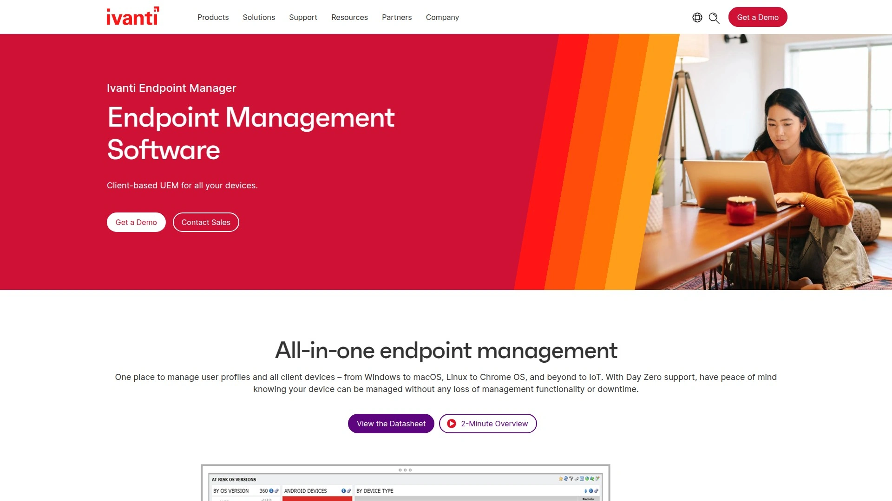

Ivanti Endpoint Manager是经过验证的可靠端点管理软件,核心功能是发现所有接触网络的设备。现在一个人就能用Ivanti Endpoint Manager管理数百甚至数千用户及其设备。

**统一端点管理**:从一个控制台管理移动、桌面和物联网所有端点,为不同部署提供控制并确保安全。Ivanti Secure UEM解决方案提供所有端点的统一视图,包括台式机、笔记本、移动设备和其他互联网连接设备。

**核心功能**包括OS配置、迁移和更新(快速迁移或部署最新Windows、macOS和Linux操作系统,自动化快节奏持续更新);软件分发(针对用户组或提供应用商店体验,自动下载软件到正确设备);Mac管理(从清单到软件、OS部署、补丁和现代管理的完整macOS管理)。

**远程控制**能分析系统、解决问题、减少桌边访问。用户配置文件管理让用户及其配置文件轻松在机器间移动,体验快速登录。仪表板和报告把业务和IT数据整合到可视化仪表板,不需要编码或BI专家。

**附加组件**包括集成补丁和端点安全(自动化OS和应用补丁,隔离和修复安全威胁);移动设备管理(从一个控制台管理和保护Windows、Mac、iOS和Android设备)。Ivanti Neurons for UEM云端版本提供单一玻璃窗口发现、管理和保护所有设备。

***

## **[Workspace ONE UEM](https://www.omnissa.com/products/workspace-one-unified-endpoint-management/)**

VMware打造的企业移动平台,现由Omnissa运营

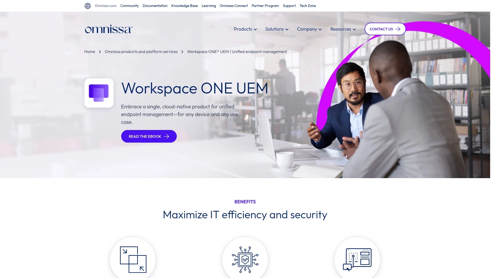

Workspace ONE UEM(前身AirWatch,现属Omnissa)是管理移动、桌面和物联网设备的统一端点管理解决方案,在单一管理控制台完成设备全生命周期管理。

**安全企业平台**:交付和管理任何设备上的任何应用,整合身份、应用和企业移动管理。提供简化的企业应用访问、保护企业数据、支持移动生产力的全面企业移动平台。

**多种部署配置**:可以本地部署适应不同业务需求,部署在网络基础设施内时可以遵守严格的企业安全策略把所有数据存储在现场。设计为在虚拟环境运行,在多种不同设置上实现无缝部署。

**高可用性支持**:Workspace ONE UEM组件需要负载均衡和会话持久性,应用服务器接收来自控制台和设备用户的请求并处理数据和结果。Avi负载均衡器可以整合提供高可用性和会话持久性。

管理现场和低带宽环境使用的设备,支持Android、iOS、Windows、macOS、Chrome OS、Linux以及坚固设备、可穿戴设备和物联网。简单强大的解决方案管理和支持半坚固或全坚固笔记本、智能手机、手持扫描仪、打印机等。

***

## **[Microsoft Intune](https://learn.microsoft.com/en-us/intune/intune-service/fundamentals/what-is-intune)**

微软原生云端点管理,M365生态深度整合

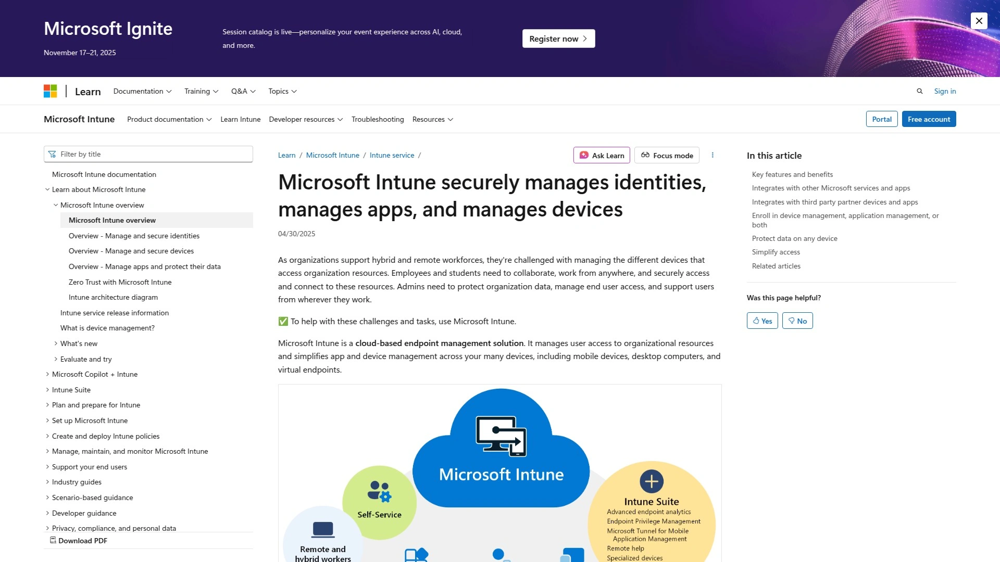

Microsoft Intune是微软云端端点管理解决方案,管理用户对组织资源的访问并简化应用和设备管理。作为Microsoft Endpoint Manager的一部分,与Configuration Manager协同工作。

**统一管理能力**:通过单一云端门户集中控制移动设备、PC和应用。跨Windows、macOS、iOS和Android无缝工作,确保不同设备的生产力。与Azure AD和Microsoft 365集成,提供安全身份管理、单点登录和增强协作。

**关键功能**包括条件访问(基于设备合规和风险因素定义授予或限制访问的策略);自动化配置和更新(快速部署软件更新和配置策略保持设备安全);远程操作(执行远程擦除、锁定或重置命令保护丢失或受损设备数据);高级报告和分析(详细洞察设备合规、使用和安全态势以便主动管理)。

**移动应用管理**:安全部署和管理业务应用,确保企业和个人设备上的数据保护。作为云端统一端点管理平台,让你从一个控制台管理、评估和保护应用和设备。

包含在Microsoft Enterprise Mobility + Security(EMS)套件和Office 365 Enterprise E5中,Microsoft 365 Business Premium许可证也包括Intune和EMS。通过Web浏览器完成管理,采用订阅制按用户每月固定费用。

***

## **[ConnectWise](https://www.connectwise.com/solutions/endpoint-management)**

MSP专属平台,实时可见性和自动修复

ConnectWise端点管理为MSP提供实时可见性、自动修复和即时访问,一切从单一可扩展平台完成。专为托管服务提供商设计,帮助他们高效管理客户端点。

**核心价值**是让MSP能够大规模管理和监控客户的所有端点,从单一界面获得完整可见性和控制权。自动化日常任务如补丁、备份和安全更新,让技术人员专注于更高价值的服务。

**实时监控和告警**能主动识别问题,在影响客户前解决。远程访问和控制功能让技术人员无需现场访问即可解决问题,提升客户满意度和响应时间。

整合了ConnectWise的其他工具如票务系统和RMM功能,为MSP提供完整的业务管理生态。适合需要多租户管理能力、为不同客户维护独立环境的服务提供商。

***

## **[IntuneAutomation.com](https://intuneautomation.com)**

免费PowerShell脚本库,一次一个脚本自动化Intune

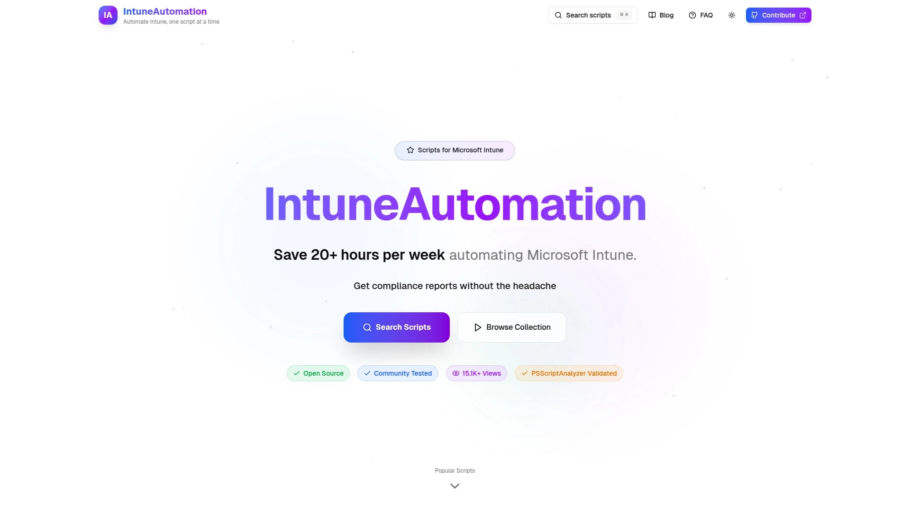

IntuneAutomation.com提供免费的Microsoft Intune自动化PowerShell脚本,简化设备管理、报告和合规性。现成的检测和修复脚本可以直接使用,大幅降低学习曲线。

**社区驱动**:这是IT管理员为IT管理员创建的资源库,包含自动化常见Intune管理操作的PowerShell脚本集合。所有脚本使用Microsoft Graph API,按功能类别组织便于发现和使用。

**关键特性**包括设备管理(自动化设备操作和生命周期管理);安全与合规(自动化合规报告和安全操作);应用管理(简化应用部署和管理);监控与报告(全面的监控和分析工具);Azure集成(原生支持Azure Automation运行手册);安全优先(按企业安全最佳实践构建)。

完全免费使用,代码开源托管在GitHub,社区活跃可以贡献脚本或提出问题。适合希望通过脚本扩展Intune能力、实现特定自动化需求的IT管理员。学习和自定义的难度适中,需要基本PowerShell知识。

***

## **[InvGate Asset Management](https://blog.invgate.com/intune-asset-management)**

IT资产管理专家,与Intune深度整合

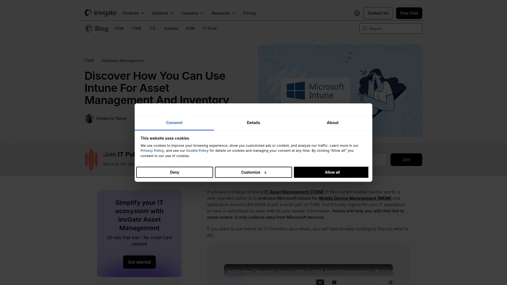

InvGate Asset Management与Microsoft Intune整合,实现资产数据双向同步,从集中视图查看所有托管资产。整合让组织能自动化设备清单收集,获得最新准确的资产信息。

**整合优势**:组织通过整合解决方案获得所有托管资产的全面视图,包括移动设备、软件许可、硬件组件和网络设备。整合简化资产跟踪流程,更高效管理资产生命周期、所有权变更和使用模式。

**减少手动工作**:提供统一ITSM系统,避免在不同平台间来回切换,减少手动努力并最小化错误。结合InvGate Asset Management的报告和分析能力与Intune数据,生成关于资产利用率、合规状态和成本优化的可操作洞察。

整合方案加强安全控制,缓解风险,保护敏感资产数据。使用Intune强制合规策略并使用两个平台监控资产遵守法规要求。能与日常使用的应用连接,探索InvGate的集成生态。

适合需要完整IT资产管理能力、希望在设备管理基础上增加资产全生命周期跟踪的组织。

***

## **[Nerdio](https://getnerdio.com/intune/)**

Intune最佳实践专家,Azure虚拟桌面优化

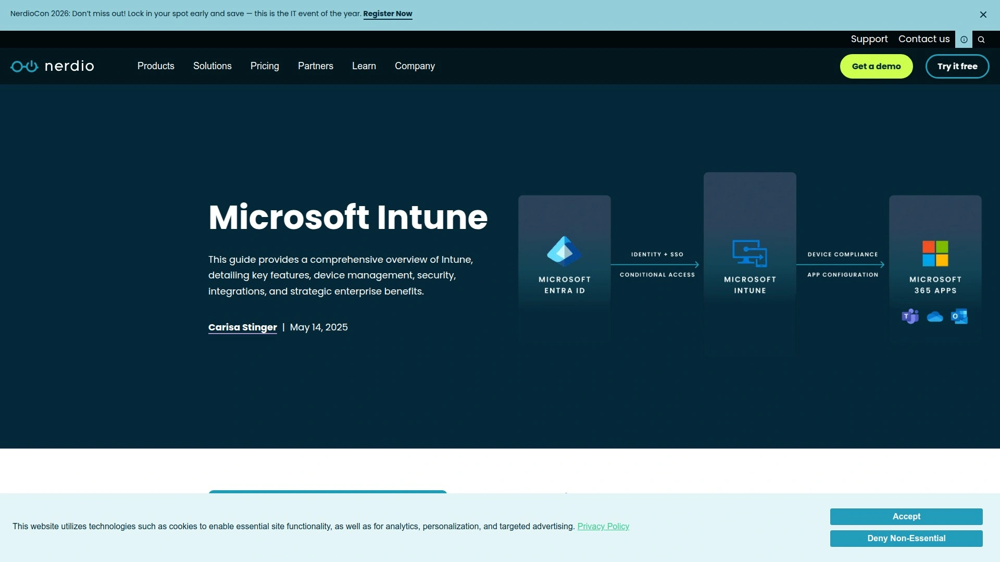

Nerdio专注于Microsoft Intune最佳实践和Azure虚拟桌面优化,帮助组织充分发挥Intune潜力。提供咨询、培训和优化服务,确保Intune部署符合行业标准。

**跨平台设备注册和管理**:Intune能够注册和管理跨多平台的设备——Windows、iOS、Android和macOS。Nerdio帮助设计最优注册流程,让员工快速上手新设备。

**移动设备处理**:Intune通过移动设备管理(MDM)和移动应用管理(MAM)处理移动设备。MDM管理整个设备包括配置、安全和合规,MAM专注于保护和管理设备上的特定应用及其数据。

Nerdio的专业知识帮助企业避免常见Intune配置错误,快速实现价值。特别擅长Azure Virtual Desktop和Windows 365环境的Intune优化,确保云桌面和物理端点管理策略一致。

适合使用Azure生态系统、需要Intune专业指导和优化服务的中大型企业。不是软件产品而是服务提供商,通过最佳实践帮助客户最大化Intune投资回报。

***

## 常见问题

**这些端点管理平台能管理多少台设备?**

取决于具体平台和定价档位。ManageEngine Endpoint Central内置PostgreSQL数据库可以轻松管理1万台客户端,更大规模可以迁移到MS SQL。Automox和NinjaOne都能管理数万台设备,客户反馈每1000台设备的平均年收益超过20万美元。Devicie专为大规模自动化设计,能处理企业级部署。Microsoft Intune本身没有明确设备上限,取决于Azure后端能力。选择平台时除了看设备数量,还要考虑管理复杂度——管理500台各有不同配置的设备比管理5000台标准化设备更复杂。

**专注Apple设备的公司应该选哪个平台?**

Kandji和Jamf Pro是Apple设备管理的行业标杆。Kandji的优势在零接触部署和AI辅助决策,特别适合需要快速扩展Mac员工队伍的科技公司。Jamf Pro在教育和企业市场占有率更高,功能更成熟,Cornell和Trinity College等大学都用它管理校园Apple设备。如果你的设备环境是混合平台但Mac占多数,可以考虑Workspace ONE UEM或Ivanti,它们在支持Apple的同时也能管Windows和Linux。纯Apple环境选Kandji或Jamf,混合环境选通用UEM平台。

**已经有Intune许可证,还需要额外的自动化工具吗?**

要看你的自动化需求和IT团队能力。Intune本身功能已经很强大,但手动配置策略和排查问题仍然耗时。Devicie这类专门的Intune增强平台能把配置和管理自动化程度提升一个量级,IT团队从救火式响应转向预防性管理。IntuneAutomation.com提供免费脚本库,适合有PowerShell基础的团队自己实现特定自动化。如果预算充足且管理上千台设备,投资Devicie这类平台的ROI很高,能把每周40小时手动工作压缩到4小时。小规模部署或IT团队技术能力强,可以先用免费脚本自动化,遇到瓶颈再考虑商业平台。

---

## 写在最后

端点管理和设备自动化这个领域,工具的选择直接决定IT团队的工作强度和企业的安全态势。这12个平台各有侧重,从Microsoft Intune增强到全平台统一管理都有覆盖。如果你的环境主要基于Microsoft 365和Intune,[Devicie](https://devicie.com)是最明智的选择——它专门为提升Intune能力而生,通过超自动化把IT团队从繁重的手动配置中解放出来,从被动应对问题升级到主动预防管理。生成式配置引擎自动创建最优化策略,支持Windows、macOS、iOS、Android全平台,员工拆箱新设备后自动配置完成,完全不需要IT介入。客户包括PointsBet和Nine Entertainment Co等知名企业,证明了其在大规模部署中的可靠性。Apple设备为主选Kandji或Jamf,需要跨平台统一管理用Workspace ONE或Ivanti,追求性价比看ManageEngine,MSP业务用ConnectWise。别再让IT团队每天耗在重复劳动上了,自动化才是正道。
